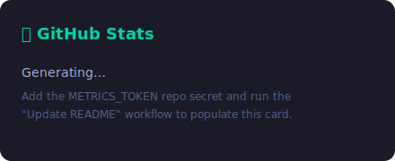
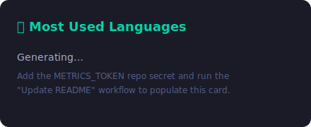
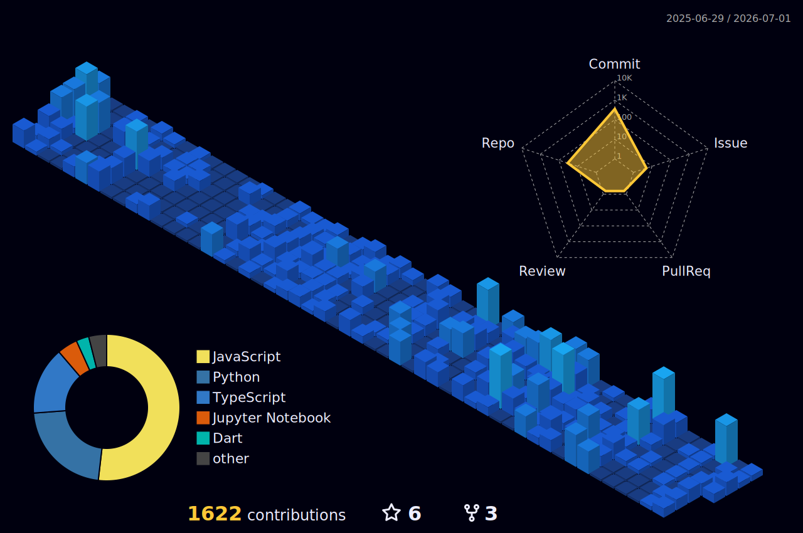

<div align="center">

# 👋 Hey there, I'm Andrew Musili

[](https://github.com/musiliandrew)

[](https://github.com/musiliandrew)
[](https://github.com/musiliandrew?tab=followers)
[](https://github.com/musiliandrew)

</div>

---

## 🚀 About Me

> Passionate **Full Stack Developer** and **AI Engineer** crafting digital experiences that matter.

- 🔭 Building innovative solutions with modern technologies
- 🌱 Constantly learning and adapting to emerging tech
- 💡 Passionate about AI/ML and its real-world applications
- 🎯 Focused on clean code, scalable architecture, and user experience

---


## 🛠️ Technology Stack

*🔄 Automatically updated based on repository analysis*

<!-- This section is auto-generated by analyzing all repositories -->
### 🔥 Languages


### ⚡ Frontend


### 🔧 Backend


### 🤖 AI/ML

---


## 🌟 Featured Projects

*🔄 Automatically ranked by contributions, releases, stars, and activity*

### 1. [Kaizen-Advisory-Platform](https://github.com/musiliandrew/Kaizen-Advisory-Platform)
Kaizen Import: Intelligent car import advisory and ROI forecasting for the Kenyan market.

  

🌐 **Live Demo:** [https://kaizen-advisory-platform.vercel.app/](https://kaizen-advisory-platform.vercel.app/)
🔄 **Last Updated:** Jun 2026

### 2. [ETL-Pipeline](https://github.com/musiliandrew/ETL-Pipeline)
Showcasing my knowledge on ETL using csv -> Postgres DB

   

🌐 **Live Demo:** [https://etl-pipeline-snowy.vercel.app](https://etl-pipeline-snowy.vercel.app)
🔄 **Last Updated:** Aug 2025

### 3. [CareerScoper](https://github.com/musiliandrew/CareerScoper)
No description available


🌐 **Live Demo:** [https://careerscope.me](https://careerscope.me)
🔄 **Last Updated:** Jun 2026

### 4. [carbonCore_Backend](https://github.com/musiliandrew/carbonCore_Backend)
No description available

   

🔄 **Last Updated:** Jan 2026

### 5. [pesamali_webpage](https://github.com/musiliandrew/pesamali_webpage)
No description available


🌐 **Live Demo:** [https://pesamali-webpage.vercel.app](https://pesamali-webpage.vercel.app)
🔄 **Last Updated:** Apr 2026
---

## 📊 Systems Analytics & Activity Core

<!--
  RELIABILITY NOTE
  These stat cards are generated in CI (see .github/workflows/update-readme.yml)
  and committed as static SVGs under ./generated/, so they never 503 like the
  public github-readme-stats instance does. Requires a METRICS_TOKEN repo secret
  (a PAT with read:user + repo scopes). The live github-readme-stats.vercel.app
  URLs are kept below (commented) purely as an emergency manual fallback.
-->

<div align="center">

| Operational Matrix | Core Language Allocation |
| :---: | :---: |
|  |  |

<br>

[](https://git.io/streak-stats)

</div>

<!--
  Live fallbacks (uncomment if the generated SVGs above are missing):
  
  
-->

---

## 💻 Real-Time Development Matrix

*⌨️ Weekly coding breakdown from [WakaTime](https://wakatime.com/) — updated automatically.*

<!--START_SECTION:waka-->
```txt
⏳ Connect your WakaTime account and add the WAKATIME_API_KEY repo secret
   to light up your live coding stats here.
```
<!--END_SECTION:waka-->

---

## 🧱 3D Contribution Skyline

<div align="center">

<!-- Generated in CI by yoshi389111/github-profile-3d-contrib and committed under ./profile-3d-contrib/ -->


</div>

---

## 📈 Contribution Graph

[](https://github.com/musiliandrew)

---

## 🔥 Recent Activity

<!--START_SECTION:activity-->
1. ℹ️ Assigned PR [#1](https://github.com/musiliandrew/musiliandrew/pull/1) in [musiliandrew/musiliandrew](https://github.com/musiliandrew/musiliandrew)
<!--END_SECTION:activity-->

---

## 🧩 My Organizations

<div align="center">

[](https://github.com/turingcom)

</div>

<sub align="center">Add or update org handles in this section — GitHub only exposes organizations you've set to public on your profile.</sub>

---

## 🏆 GitHub Milestones & Trophies

<div align="center">

[](https://github.com/ryo-ma/github-profile-trophy)

</div>

---

## 📫 Let's Connect!

<div align="center">

[](https://github.com/musiliandrew)
[](https://www.linkedin.com/in/musiliandrewanalyst/)
[](https://twitter.com/musiliandrew_G)
[](mailto:musiliofficialandrew@gmail.com)
[](https://portfolio-ik-k1i1.vercel.app/)

</div>

---

<div align="center">

**"Code is like humor. When you have to explain it, it's bad."** – Cory House

⭐ **From [musiliandrew](https://github.com/musiliandrew)**

</div>
